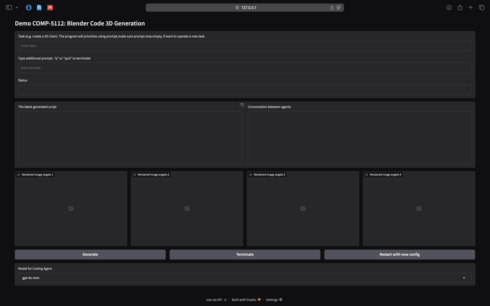

# 3D Blender code generation

## Preparation

```bash
bash scripts/prepare_env_for_local.sh
```

## Usage

1. Paste Openrouter api key to [.env](.env)

### Run file
```bash
python main.py task=TASK
```
``Task``: Must be in a pair of single/double quotation marks.

Example:

```python main.py task="create a table"``` ✅

```python main.py task=create a table``` ❌

### Run app

```bash
python app_local.py
```



### Cloud platform

Visit [Demo link](https://huggingface.co/spaces/nguyenminh4099/COMP-5112)

## Result


The latest script is saved in **anchor_coding.py** in [assets/blender_script](assets/blender_script)

## Files structure

``` 
├── .gitignore
├── .env
├── requirements.txt
├── pyproject.toml
├── uv.lock
├── README.md
├── LISCENSE
├── main.py
├── app.py
├── app_local.py
├── assets
|   ├── blender_script
|   └── rendered_images
├── outputs
|   └── YYYY-MM-DD
|       └── hh-mm-ss
|           └── main.log
├── scripts
|   ├── prepare_env_for_app.sh
|   └── prepare_env_for_local.sh
├── configs
|   ├── job.yaml
|   ├── graph.yaml
|   ├── hydra.ymal
|   └── agents
|       ├── coding.yaml
|       ├── critic.yaml
|       ├── planner.yaml
|       ├── retriever.yaml
|       ├── user.yaml
|       └── verification.yaml
├── src
|   ├── base
|   |   ├── agent.py
|   |   ├── coordinator.py
|   |   ├── graph.py
|   |   ├── mapping.py
|   |   ├── state.py
|   |   ├── structured_output.py
|   |   ├── tool.py
|   |   └── utils.py
|   ├── agents  
|   |   ├── coding.py
|   |   ├── critic.py
|   |   ├── planner.py
|   |   ├── retriever.py
|   |   ├── user.py
|   |   └── verification.py
|   ├── camera  
|   |   └── ...
|   ├── task  
|   |   └── ...
|   └── utils  
|       ├── constants.py
|       ├── exception.py
|       ├── file.py
|       └── types.py
├── templates
|   ├── prompt
|   |   ├── coding.yaml
|   |   ├── critic.yaml
|   |   ├── planner.yaml
|   |   ├── retriever.yaml
|   |   └── verification.yaml
|   └── camera_templates
|       ├── template.json
|       ├── template_1.json
|       ├── ...
|       └── template_n.json
└── vectorstores
    └── faiss_4_0
        ├── index.faiss
        └── index.pkl

```

## Used data

[Visit link](https://huggingface.co/datasets/nguyenminh4099/COMP-5112/tree/main/)

- Data used to build vectorstore. **html**
  in [external](https://huggingface.co/datasets/nguyenminh4099/COMP-5112/tree/main/data/external/blender_python_reference_4_5),
  **pdf**
  in [interm](https://huggingface.co/datasets/nguyenminh4099/COMP-5112/tree/main/data/interm/blender_python_reference_4_5)

## Files and folders

List of files/folders and purposes:

- [assets/blender_script](assets/blender_script): save all generated scripts
- [assets/rendered_images](assets/rendered_images): save all rendered images
- [configs](configs): contains config files for all agents, graph, and logging
- ``outputs/YYYY-MM-DD/hh-mm-ss/main.log``: save all logs
- [prepare_env_for_local.sh](scripts/prepare_env_for_local.sh): prepare all needed things to run
- [templates/prompt](templates/prompt): contain prompt templates of all agents
- [camera_templates](templates/camera_templates): setting file cameras to capture image
- [vectorstores](vectorstores): save vector store
- [.env](.env): contains API keys and other environment variables
- [main.py](main.py): the running main

## Logging and tracking

During the code is running, the logging messages will be printed continuously with some useful blocks:

### Logging message

```
--------------------------------------------------[Agent Name]--------------------------------------------------
[logging messages]: logs in a agent
****************************************************************************************************************
```

### Conversation signals

```
💬 💬 💬 💬 💬 💬 💬 💬 💬 CONVERSATION 💬 💬 💬 💬 💬 💬 💬 💬 💬
[conversation between agent and human in a particular agent]
💬 💬 💬 💬 💬 💬 💬 💬 💬 💬 💬 💬 💬 💬 💬 💬 💬 💬 💬 💬 💬 💬
```

### Conversation format

```
================================ System Message ================================

[content]
================================ Human Message =================================

[content]
================================== Ai Message ==================================

[content]
================================= Tool Message =================================

[content]
```

### Log message

```
[date_time][file] - <message> [#line_in_file]
```

### Review conversation

See file `outputs/YYYY-MM-DD/hh-mm-ss/main.log` to inspect, analyze reasoning and debug.

## Configuration

- agent: visit [agents](configs/agents)
- prompt: visit [templates/prompt](templates/prompt)[prompt](templates/prompt)
- camera: visit [camera_templates](templates/camera_templates)

## Demo

[Clink here](https://huggingface.co/spaces/nguyenminh4099/COMP-5112)
