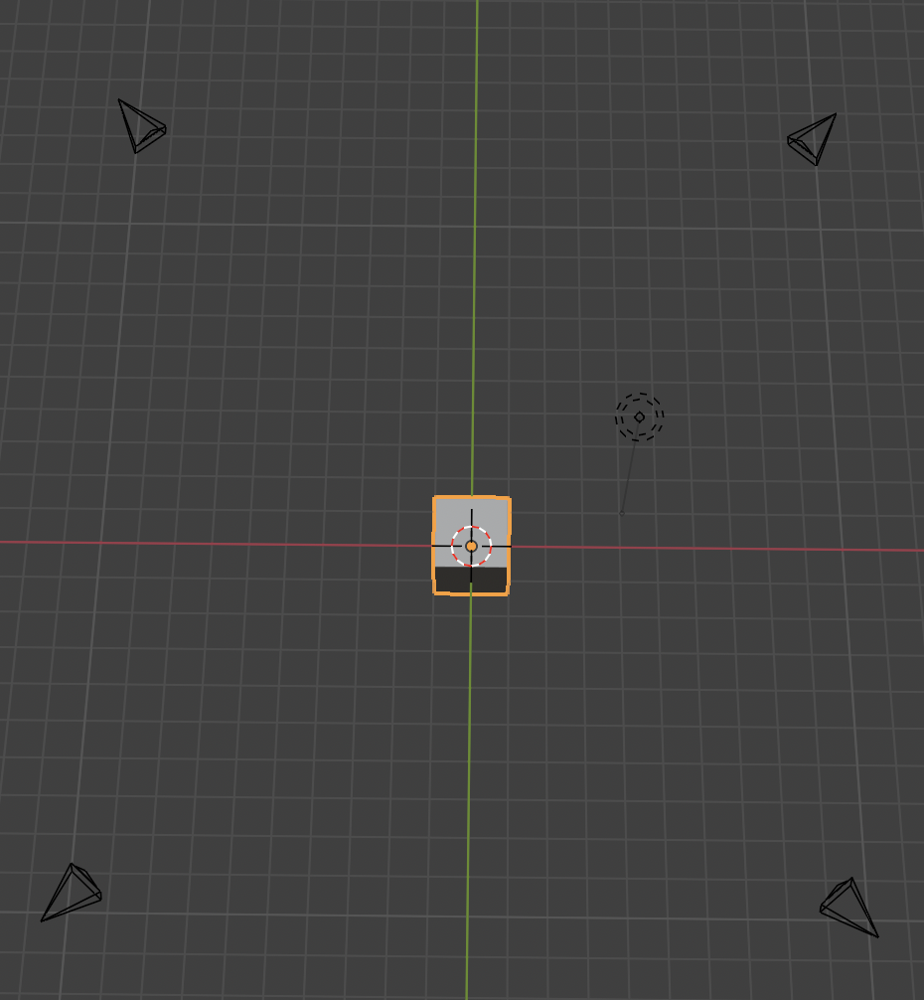

## Show camera

If you have Blender application in your computer. Run the below command to see camera positions

```bash
blender --python camera_setting.py
```



## Future works

Setup camera automatically instead of set fixed cameras.